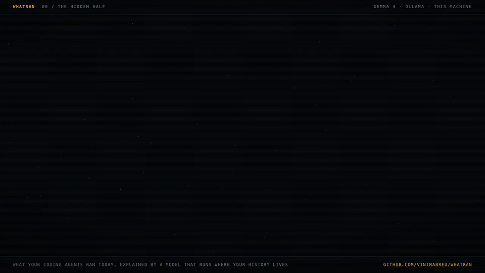

# whatran

[](https://github.com/vinimabreu/whatran/actions/workflows/tests.yml)

What your coding agents ran in your terminal today, explained by a model that runs on your own machine.



Coding agents run shell commands all day. Claude Code keeps every one of them in its session files, and since 2026 atuin can record them too (`atuin hook install claude-code`), tagged with the agent that ran them. Then nobody reads any of it: atuin hides agent commands from its search by default, so they don't clutter your history, and the session files are thousands of lines of JSON.

whatran reads that history once a day and answers three questions:

1. **Where did the agents work?** Commands per agent and project, how many failed, how many were stopped before they ran.
2. **What deserves a second look?** `curl | sh`, `rm -rf` on something that isn't a cache, `git push --force`, reading `.env` or `~/.ssh`, `sudo`, writing to your `.zshrc`, new packages arriving with install scripts. The same rules run on scripts sent to other machines over `ssh`, marked as remote.
3. **What was the agent trying to do?** A short note in plain words, written by [Gemma 4](https://ollama.com/library/gemma4) through Ollama, on your machine.

Your shell history is where tokens typed inline, database URLs with passwords and client names in paths end up. whatran keeps it on your machine: it reads the files read-only, it talks to Ollama on this machine only (unless you pass `--allow-remote-model`), and it ignores any HTTP proxy set in your environment, so the prompt can't take a detour.

## Install

You need Python 3.10 or newer. For the note you also need [Ollama](https://ollama.com) and the model:

```sh
ollama pull gemma4:12b
pipx install git+https://github.com/vinimabreu/whatran
```

whatran itself has no Python dependencies, so `git clone` and `python3 -m whatran` work too. Without Ollama you still get the counts and the flags; only the note is missing.

## Use

```sh
whatran                    # today, since midnight
whatran --since 24h        # or 3d, 1w, 2026-10-01
whatran --lang pt          # the note in Brazilian Portuguese
whatran --all              # flag your own commands too, not only the agents'
whatran --no-model         # counts and flags only
whatran --json             # everything, for another tool
```

It finds its sources by itself:

| Source | What it holds | Setup |
|---|---|---|
| atuin (`~/.local/share/atuin/history.db`) | your commands, plus agent commands when the hook is on | `atuin hook install claude-code` (or `codex`, `opencode`, `pi`) |
| Claude Code sessions (`~/.claude/projects`) | every `Bash` call Claude Code made, with its description and its result | none |

With both present, atuin counts your commands, and the session files fill in Claude Code's when atuin has none of them. A session that was resumed copies its earlier calls into a new file; whatran counts each call once. `--source atuin` or `--source claude-code` picks one.

To try it without your own history, there is a made-up day:

```sh
python3 examples/make_demo.py demo/history.db
whatran --db demo/history.db --since 2d
```

With `--db`, whatran reads only that file, so the demo never mixes in your own sessions.

## How it decides

The design is a split. Plain code counts, groups and flags; the model only writes the paragraph.

**Rules, not the model, decide what gets flagged.** Each rule in [`whatran/rules.py`](whatran/rules.py) is a regular expression with a reason a person can read, so the same command gets the same answer every day. They read one simple command at a time, from the part of the text the shell runs ([`shellview.py`](whatran/shellview.py)): the body of a heredoc fed to Python or a commit message is data, so it is not matched; the script of `bash -c` or `eval`, and a heredoc fed to a shell, are code, so they are. A script sent with `ssh` (quoted, unquoted, or as a heredoc) goes through the same rules and comes back marked as remote. `rm -rf node_modules __pycache__` is not flagged; `rm -rf node_modules && rm -rf migrations` is.

The first version skipped that step. On one real working day of mine (548 agent commands, midnight to mid-afternoon) it raised 64 flags. 21 were wrong: nine ordinary file transfers, five test strings inside quoted code, four inside heredoc bodies fed to Python or Node, three cache cleanups. 41 of the other 43 ran on servers inside an `ssh` command, `sudo` calls and one crontab change, and the first version reported them as if they had happened on my laptop: as local `sudo`, as a local crontab change, or as plain file transfers. Rules now follow the script into `ssh` and say "on another machine", which also caught seven remote `sudo` calls the first version missed. Grouped, the same day reads as four entries.

**Repeated flags are grouped** by agent, project and rule, so 46 `ssh` commands with `sudo` on one server read as one line with `x46`.

**The note is checked before you see it.** The model gets the facts as JSON: counts, the projects, and each flag with its intent and the commands just before and after it in the same session. Its note then has to pass [`check_note`](whatran/digest.py): every command it quotes in backticks must be in the facts; every number must be one of the counts or exit codes the facts state, and every clock time one of the flags' times; every `[F1]` it cites must exist, and every flag must be cited. Numbers written as words are not checked. If the note fails, whatran asks once more with the problems listed; if it fails again, the note is not shown and the report lists what failed. The facts never depended on the model, so they are always there.

**Common token formats are masked before anything is shown or sent to the model**, in commands and in the agents' own descriptions: GitHub, OpenAI, Anthropic, Stripe, Hugging Face, Slack, GitLab and npm tokens, AWS key IDs and secret keys set through `aws configure`, Telegram bot tokens, bearer and API-key headers, `*_TOKEN=` and `*_PASSWORD=` values, `--password`/`--token` flags, `"api_key": "..."` in JSON, `mysql -p...`, and passwords in connection URLs. A secret in a format not on that list is shown as typed.

## What it does not do

- It reports after the fact. It does not block a command; atuin and your agent's own permission settings are where that happens.
- Rules read the command text. A script that does something dangerous inside is only as visible as its name, variables are not expanded, and an unusual spelling of a command can slip past a rule.
- Both sources only see the shell. File edits an agent makes through its own tools are not commands and do not appear.
- It does not explain your own commands, only the agents'. `--all` flags yours, but the note is about the agents.

## Tests

```sh
pip install pytest
python -m pytest
```

318 tests: every rule against commands that should and should not trip it, the agent detection against atuin's own rules (including its exception for a user whose name is an agent's), both readers on databases and session files written the way atuin and Claude Code write them, and the note check against notes that invent commands, numbers and flags. None of them needs Ollama.

## Credits

whatran reads [atuin](https://github.com/atuinsh/atuin)'s database, and its rule for telling an agent's command from yours is ported from atuin's own `History::is_agent`, including its exception for a person whose username is an agent's name. The schema comes from atuin's migrations.

## License

MIT
